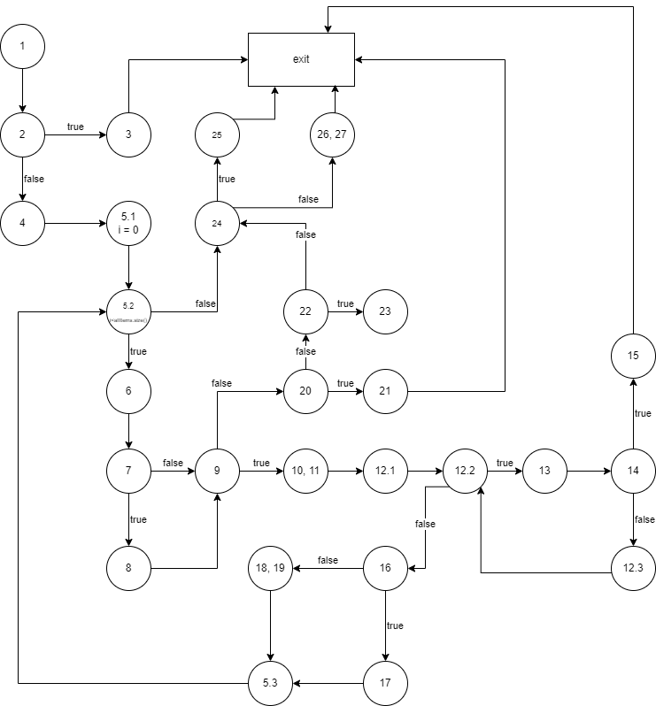

# Втора лабораториска вежба по Софтверско инженерство

## Јана Петреска, бр. на индекс 226002

### Control Flow Graph

### Цикломатска комплексност

Цикломатската комплексност на овој код е 10, истата ја добив преку формулата P+1, каде што P е бројот на предикатни јазли. Во случајoв P=9 заради 2та for циклуса и 7те if statements, па цикломатската комплексност изнесува 10.

### Тест случаи според критериумот Every branch

Има 8 тестови:

1. public void nullItems() кадешто `allItems = null`
   * Вредноста на параметарот allItems е null и се очекува програмата да фрли `RuntimeException`.

2. public void invalidBarcode() кадешто постои `item =  ["bread", "123a", 30, 0.1f]`
   * allItems ќе содржи елемент којшто нема валиден баркод, односно содржи друг карактер освен цифра. Се очекува програмата да фрли `RuntimeException`.

3. public void nullBarcode() кадешто постои `item =  ["bread", null, 30, 0.1f]`
   * allItems ќе содржи елемент чијшто баркод е еднаков на null. Се очекува програмата да фрли `RuntimeException`.

4. public void unknownName() кадешто постои `item =  ["", null, 30, 0.1f]`
   * allItems ќе содржи елемент чијашто должина на име е 0. Се очекува програмата да додели име на елементот `unknown`.

5. public void validPaymentNoDiscount()
   * Сите елементи во листата ќе бидат без попуст, но сумата на нивните цени ќе биде помала или еднаква на вредноста на `payment` параметарот. Очекуваме програмата да врати true.

6. public void invalidPaymentNoDiscount()
   * Сите елементи во листата ќе бидат без попуст и сумата на нивните цени ќе биде поголема од вредноста на `payment` параметарот. Очекуваме програмата да врати false.

7. public void validPaymentWithDiscount()
   * Сите елементи во листата ќе бидат со попуст и сумата на нивните цени ќе биде помала или еднаква на вредноста на `payment` параметарот. Очекуваме програмата да врати true.
  
8. public void invalidPaymentWithDiscount()
   * Сите елементи во листата ќе бидат со попуст, но сумата на нивните цени ќе биде поголема од вредноста на `payment` параметарот. Очекуваме програмата да врати false.

Со овие тест примери е задоволен Every branch критериумот.
